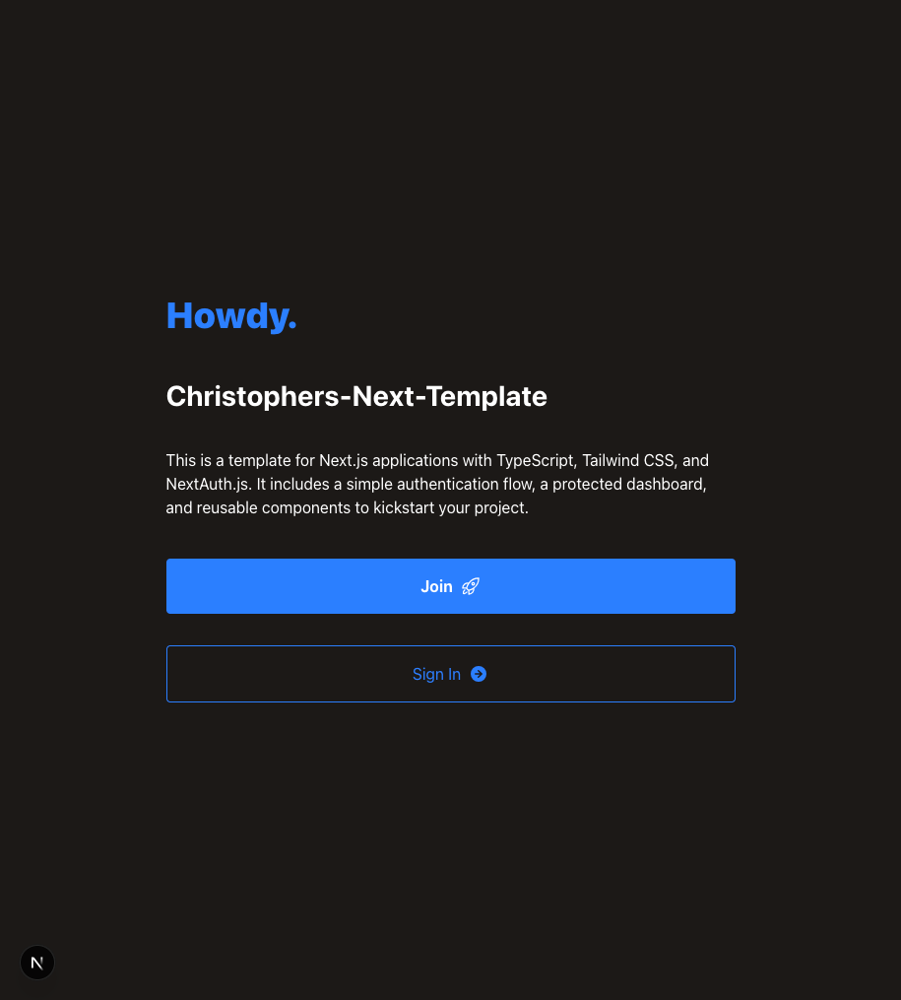

# Christophers-Next-Template



## A modern, minimal authentication starter for developers, built with Next.js, TypeScript, Prisma, and Tailwind CSS.

**Welcome!** This starter kit is designed for developers who want a clean, extensible foundation for building modern, full-stack web applications with authentication. Use it as a base for your next SaaS, dashboard, or internal tool. Contributions and forks are encouraged—make it your own!

## Features

- **Next.js 15** with App Router
- **TypeScript** for type safety
- **Prisma** ORM with PostgreSQL
- **ESLint** and **Prettier** for code quality
- **NextAuth.js** for authentication (email & password)
- **Tailwind CSS** for styling
- **Heroicons** for modern SVG icons
- User registration and login flows
- Protected dashboard for authenticated users

## Getting Started

Clone and set up the project in minutes:

### Prerequisites

- Node.js 18+
- PostgreSQL database

### Installation

1. Clone the repository:
   ```bash
   git clone <repo-url>
   cd Christophers-Next-Template
   ```
2. Install dependencies:
   ```bash
   yarn install
   ```
3. Configure environment variables:
   - Copy `.env.local.example` to `.env.local` and fill in your database and secret values.
4. Run Prisma migrations:
   ```bash
   yarn prisma migrate deploy
   ```
5. Start the development server:
   ```bash
   yarn dev
   ```

Visit [http://localhost:3000](http://localhost:3000) to view the app.

## Project Structure

- `src/app/` — Next.js App Router pages (home, join, sign-in, dashboard)
- `src/components/` — Reusable UI components (Button, Spinner, Providers)
- `src/lib/` — Prisma and authentication logic
- `prisma/` — Prisma schema and migrations
- `public/` — Static assets and icons

## Customization

This template is intentionally minimal. Extend or modify any part to fit your project:
- Add new pages or API routes in `src/app/`
- Create custom UI components in `src/components/`
- Adjust authentication logic in `src/lib/auth.ts`
- Update styles via Tailwind config or CSS

## Using Heroicons

This project uses [Heroicons](https://heroicons.com/) for modern SVG icons in React components.

### How to Use Heroicons

- The `@heroicons/react` package is installed as a dependency.
- Import icons into your components. There are two main styles and sizes.
- Use icons as React components, e.g. `<RocketLaunchIcon className="w-5 h-5" />`.
- The custom `Button` component supports passing icons as `startIcon` or `endIcon` props.

For more icons and usage details, see the [Heroicons documentation](https://heroicons.com/).

## License

This project is open source and available under the [MIT License](LICENSE).

## Scripts

- `yarn dev` — Start development server
- `yarn build` — Build for production
- `yarn start` — Start production server
- `yarn prisma:migrate` — Deploy database migrations
- `yarn lint` / `yarn lint:fix` — Lint code
- `yarn format` / `yarn format:fix` — Format code
- `yarn run nuke` — Remove node_modules, reinstall dependencies, and rebuild
- `yarn run clean` — Lint, format, and prettify all code

## Environment Variables

- `DATABASE_PUBLIC_URL` — PostgreSQL connection string
- `NEXTAUTH_SECRET` — Secret for NextAuth.js
